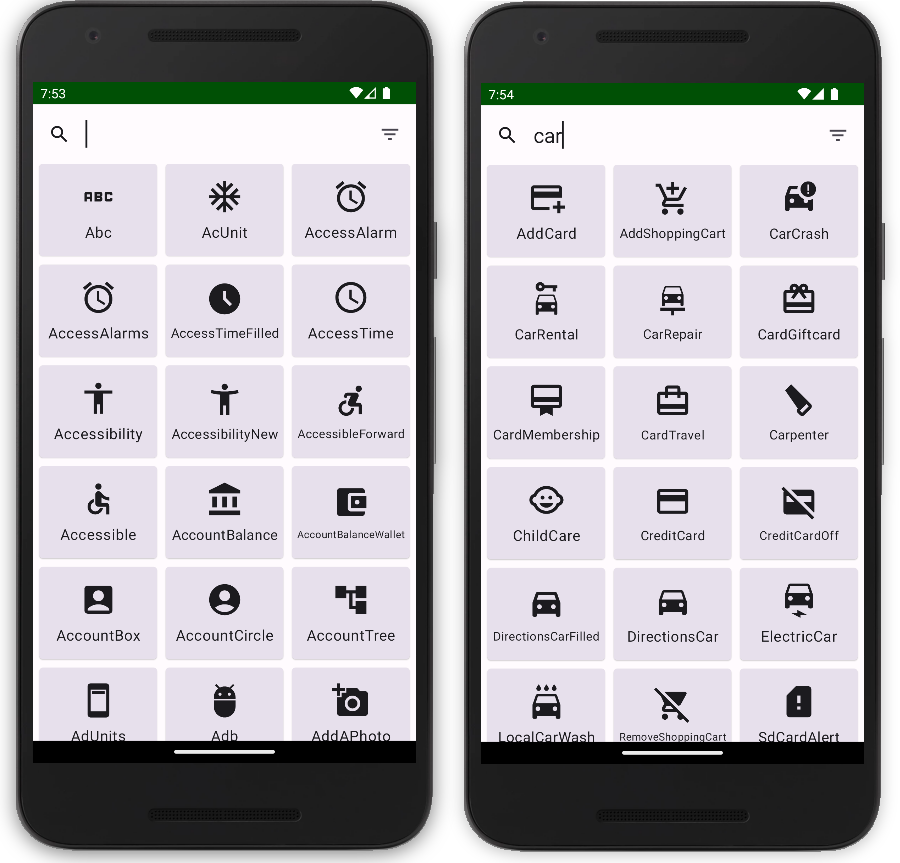

[](https://jitci.com/gh/Husseinfo/material-icons-extended-search)

# Material Icons Extended Search

A simple Android app, written using Jetpack Compose, that shows and lets you search all icons from
`androidx.compose.material:material-icons-extended`



## Usage

### 1- Gradle (app level build.gradle)

#### Dependencies

Append these lines to module dependencies:

```groovy
implementation "androidx.compose.compiler:compiler:$compose_version"
implementation "androidx.compose.material3:material3:1.0.0-rc01"
implementation "androidx.compose.ui:ui:1.3.0-rc01"
implementation 'com.github.Husseinfo:material-icons-extended-search:1.0.0'
```

### 2- Gradle (project level build.gradle)

#### Repositories

Append this lines to `repositories`:

```groovy
maven { url "https://jitpack.io" }
```

#### Compose

Append these lines to android section:

```groovy
buildFeatures {
    compose true
}
composeOptions {
    kotlinCompilerExtensionVersion '1.3.2'
}
```

### 3- View

Add a compose view to your XML layout:

```xml

<androidx.compose.ui.platform.ComposeView android:id="@+id/compose_view" android:layout_width="30dp"
    android:layout_height="30dp" />
```

### 4- Activity

#### Register launcher and response handler

```kotlin
val resultLauncher =
    registerForActivityResult(ActivityResultContracts.StartActivityForResult()) { result ->
        if (result.resultCode == Activity.RESULT_OK) {

            val iconName = IconName(result)

            Snackbar.make(
                window.decorView.findViewById(android.R.id.content),
                iconName.iconName, Snackbar.LENGTH_SHORT
            ).show()

            icon.setContent {
                MaterialTheme {
                    Surface {
                        Icon(
                            modifier = Modifier.size(40.dp),
                            imageVector = getIcon(
                                baseContext,
                                iconName.iconName,
                                iconName.iconStyle
                            ),
                            contentDescription = iconName.iconName
                        )
                    }
                }
            }
        }
    }
```

#### Launch activity

```kotlin
resultLauncher.launch(Intent(this, MaterialIconSelectorActivity::class.java))
```
